```mermaid
flowchart TD

subgraph A["A. Per-variable wrappers — 2026-09-01/02"]
  D01["D01 conceal-b: delete the binding"]
  D02["D02 per-variable ↑X/↓X wrappers"]
  D03["D03 ConcealCtx companion predicate"]
  D04["D04 tightened conceal marker"]
  D05["D05 TyWrapCncl: push the type argument in"]
  D06["D06 marker-free prefix design"]
end

subgraph B["B. v1 — the combined boundary M ⟪Θ, B₀⟫ — 2026-09-03/04"]
  D07["D07 one combined boundary, entry list Θ"]
  D08["D08 TyWrap R1 and Wrap R2: float inside"]
  D09["D09 Decision 1b/1c: predicate, or accept the gap"]
  D10["D10 Decision 1a: interior-reading license"]
  D11["D11 Reversal: license read back outward"]
  D12["D12 TyWrap′ and push-through Wrap"]
  D13["D13 Merge ⊕ with Drop∅"]
  D14["D14 W1 RunOK and W2 env premise"]
  D15["D15 W3 knowledge-preserving weakening"]
  D16["D16 W4 stop dropping"]
  D17["D17 ambient dual dualᴳ"]
  D18["D18 telescopic reveal block"]
  D19["D19 a′ unfold at entry birth"]
  D20["D20 a″ equality up to unfolding"]
  D21["D21 cnc⋆ rep-less conceal"]
  D22["D22 x-licenses plus claims-nothing"]
  D23["D23 comparison-free bwf-↓x, then SkelEq"]
  D24["D24 face-directed ⊕ keeping the witness"]
  D25["D25 Peel and TyPeel: crossings go inward"]
  D26["D26 standalone Cancel"]
  D27["D27 active/inert discipline"]
  D28["D28 MergeOK component 1 repaired"]
end

subgraph C["C. The verdict and the survey — 2026-09-05"]
  D29["D29 subject reduction is FALSE"]
  D30["D30 Decision 8: reps, PeelOK, demotion"]
  D31["D31 the boundary survey F1–F12"]
  D32["D32 redesign advice Q1–Q5"]
end

subgraph Dv2["D. v2 — conversion boundaries — 2026-09-05/06"]
  D33["D33 binder-syntactic rep storage"]
  D34["D34 mask, do not drop"]
  D35["D35 the conversion boundary M ⟪Θ, c⟫"]
  D36["D36 split per-purpose constructors"]
  D37["D37 polarity index on conversions"]
  D38["D38 IdAbsorb with the frame operator ⊳"]
  D39["D39 IdPush with the binder-lookup premise"]
  D40["D40 the v2 restructure"]
  D41["D41 v2 preservation FALSE: four rules"]
  D42["D42 the dual repaired"]
  D43["D43 TyPeelR and CancelR repaired"]
  D44["D44 the wall: four candidate invariants"]
  D45["D45 the scope move Θ₁ ⋉ Θ₂"]
  D46["D46 TypeSafety and the naming rulings"]
end

D01 -->|"Example 6: revealing Y:=X⇒X injects X into Γ₂, so L2 fails"| D02
D02 -->|"a conceal's rep must be well formed: Γ ⊢ A does not follow from lookup"| D03
D03 -->|"skip-cncl n &lt; X gives ∋:=-⊢ directly — predicate deleted, and Commute with it"| D04
D04 -->|"proposal: compile the marker away, type the body at Γ↓X"| D06
D02 -->|"how does a sealed polymorphic value meet a type application?"| D05
D05 -->|"pre-boundary counterexample: ↓X drifts under a later ΛY, Γ↓X = ∅, so [Y] pushed in is ill-typed"| D07
D06 -->|"the prefix still DROPS; only lesson 2 is taken"| D07
D05 -.->|"lesson 1 — mask, do not drop — deferred a whole design"| D34
D03 -.->|"first instance of the grounded-invariants law"| D09

D07 -->|"BoundaryRules.md §4: the two boundary-manipulation rules, R1 and R2"| D08
D08 -->|"bad: a closed well-typed value no rule can eliminate"| D09
D09 -->|"1b and 1c withdrawn; Jeremy restores the old Γ ∋ X:=A invariant"| D10
D07 -->|"Decision 3: merge nested boundaries, or let towers pile up?"| D13
D10 -->|"bad₂ under naive ≡, ¬hk-int under renaming, and Merge needs ↓X:=W⇒W"| D11
D13 -->|"MergeProbe: the grounded premise refuses the merged boundary"| D11
D08 -->|"Decision 2 REVISED: depth-1 values make TyWrap′ total and kill the ⇑ᵀ"| D12
D10 -->|"Decision 4: the dual cannot rebuild a BLOCKED knowledge slot — program P"| D14
D14 -->|"W1 is a companion predicate; W2 makes TyWrap fail preservation"| D15
D15 -->|"example E: W3's ⇓ must cross unbounded depth"| D16
D16 -->|"W4 OVERRULED — tightness is wanted for its own sake"| D17
D15 -.->|"AmbientDualProbe: E handled with ZERO traversal"| D17
D17 -->|"residue R1: chained knowledge Y:=Y′ is not a parallel reveal rep"| D18
D18 -->|"RULING: telescope REVERTED — reveal reps read in the plain exterior"| D19
D19 -->|"UnfoldProbe ¬DualCnc-a′: the dual's conceal keeps the RAW rep"| D20
D20 -->|"E★: the dual must conceal a Λ-bound reveal with no knowledge at all"| D21
D21 -->|"StarConcealProbe: E★′ — the boundary type NAMES the unknowable reveal"| D22
D22 -->|"D1Probe: starOnly is vacuous on closed reps — ⊢Tg, ⊢Tbad"| D23
D23 -->|"SkelEq discharges cancel-agree for x-pairs, so Merge can land"| D13
D13 -->|"§9f: cxP₄ is reachable, well typed and STUCK — ⊕ drops X's re-abstraction"| D24
D24 -->|"§9g double coincidence: flattening is IMPOSSIBLE under any ⊕"| D25
D25 -->|"§9i progress needs Merge, §9j det is FALSE with it"| D26
D26 -->|"CancelProbe: families α and β2 stay stuck; Cancel = Merge + Drop∅"| D27
D27 -->|"§9l: cmax Θ₁ ≤ revs Θ₂ is sufficient, not necessary"| D28
D28 -->|"§9m ¬progress and the live Peel break in DualIntProbe §5"| D29

D29 -->|"Decision 8 ask, on the five counterexamples"| D30
D30 -->|"SUPERSEDED: the bookkeeping is broken, survey first"| D31
D31 -->|"F1–F12: every typability loss is a failed rep COPY"| D32
D32 -->|"Q1 YES: store the rep once, cite it by name"| D33
D32 -->|"Q3 YES: Conversion as the conversion half of a split boundary"| D35
D33 -->|"realization (i), a global Σ-store, NOT taken — lexical scope is needed for lock blocking"| D34
D34 -->|"ConvBoundaryProbe: transport PASSES, the demotion is inexpressible"| D35

D35 -->|"Jeremy: one constructor per purpose — binder, conceal, alias?"| D36
D36 -->|"REVERTED to one boundary form with bind/lock/unlock entries"| D40
D35 -->|"conversions are polarized: ↦ flips on domains"| D37
D35 -->|"§6: a value at an id-variable conversion cannot be eliminated — T₆ stuck-well-typed"| D38
D38 -->|"IdLayerProbe: ⊳ jams; its only repair is rep-into-rep, i.e. ⊕ regrown"| D39
D39 -->|"RULING: IdPush plus the lookup premise plus the five repairs"| D40
D40 -->|"Preservation FALSE as the rules stand — four rules refuted"| D41
D41 -->|"dualScope turns a no-op unlock into a lock and replays in Θ-order"| D42
D41 -->|"TyPeelR's annotation and double shift; CancelR's residue drops Θ₁'s frame"| D43
D42 -->|"interior-dual and convCtx-dual PROVEN; PeelCase discharged"| D43
D37 -->|"§13: the pushed seal ↦ seal types at NEITHER polarity — the TyPeelR blocker"| D43
D37 -.->|"RULING: polarity DROPPED — env's frames enforce it per variable"| D46
D43 -->|"the honest contracta owe interior Θ₂ Δ ⊢ᵗ A — one wall, three rules"| D44
D44 -->|"all four invariants refuted; Jeremy: move part of Θ₂ into the inner boundary"| D45
D45 -->|"PRESERVATION PROVEN, parameter-free"| D46

D16 -.->|"kept: tightness, no term type-shifts"| D34
D18 -.->|"kept: simultaneity"| D35
D25 -.->|"kept: inward-only crossings — F10, 23 of 23 Peels"| D35
D27 -.->|"kept: active/inert and determinism"| D40
D13 -.->|"retired: towers, not merges — Q5a, F8/F9"| D35
D26 -.->|"reinstated as CancelR"| D43

classDef current fill:#d8f3e0,stroke:#137333,stroke-width:2px,color:#0b3d1a;
classDef refuted fill:#fdecea,stroke:#b3261e,stroke-width:1.5px,stroke-dasharray:5 3,color:#5f1512;
classDef reverted fill:#fff3df,stroke:#b26a00,stroke-width:1.5px,color:#5c3600;
classDef ruling fill:#e5eeff,stroke:#1a56b8,stroke-width:2px,color:#0f2f66;

class D01,D02,D03,D04,D05,D06,D07,D08,D09,D10,D11,D12,D14,D15,D16,D17,D19,D20,D22,D23,D24,D28,D29,D30,D38,D41,D44 refuted;
class D13,D18,D21,D26,D36,D37 reverted;
class D25,D27,D31,D32,D33 ruling;
class D34,D35,D39,D40,D42,D43,D45,D46 current;
```

# The design space of `strong/`

A map of the design points explored between 2026-09-01 and 2026-09-06 on
the way to the conversion-boundary calculus of `Design.md`.  Nodes are
**design points**; edges are **what moved the design** — a refuting
example, a machine-checked theorem, a probe verdict, or a ruling.

The glossary is `notes/DesignPoints.md`: one entry per node id, same ids
and same order, each with a pointer into `notes/DECISIONS.md`,
`notes/old/notes-v1.md`, `Design.md`, `Examples.agda` or a commit.

---

---

## Legend

| style | meaning |
|---|---|
| green, solid | part of the design as it stands today (`Design.md`) |
| red, dashed border | refuted or abandoned — the calculus does not contain it |
| amber | landed then reverted, proposed then withdrawn, or reverted then reinstated.  `D26` is the round trip: `Cancel` was an era-A rule, dropped when the boundary was combined, revived on Jeremy's direction at Decision 6, refuted there as a standalone rule, and reinstated in v2 as `CancelR` |
| blue | a ruling or survey finding that was confirmed and still governs v2, even where the object it ruled on is gone |
| solid arrow | the design moved here next |
| dashed arrow | a principle or artifact carried across, not a successor |

## How to read it

Read top to bottom within an era, and sideways only where two branches
were live at once.  Each edge label is the **evidence**, not a summary:
`D05 → D07` is the pre-boundary counterexample of `Design.md` §1,
`D24 → D25` is the machine-checked impossibility of flattening on the
double coincidence (`DECISIONS.md`, gauntlet §9g), `D28 → D29` is the
pair `¬progress` + `¬⊢contractum` that made both halves of type safety
false in the same hour.  A node with several incoming solid edges was
forced by more than one line of evidence (`D11`, `D17`, `D43`); a node
with several outgoing solid edges is a fork whose branches were explored
in parallel (`D35`).  The dashed arrows at the foot of the graph are the
through line — they say which era-B commitments survived the v1
refutation, and which two era-A lessons were separated by four days.
Every node id is defined, in this order, in `notes/DesignPoints.md`.

## The through line

Era A had **one wrapper per variable**, and a conceal whose interior was
the exterior *truncated* at the concealed variable; the rule that
eliminated a sealed polymorphic value pushed the type argument **into**
the sealed body.  A four-step closed program refuted it: once the conceal
drifts under a later `ΛY`, its interior `Γ ↓ X` is empty and the pushed
`[Y]` cannot type.  Two lessons were on the table — *mask, do not drop*
and *never push a type argument inward* — and **v1 took only the second**.
So era B kept dropping, and paid for it: a boundary that drops a slot has
to **rebuild** it when it dualizes, and rebuilding means **copying a
representation into a context that may not be able to spell it**.  Every
era-B mechanism — interior knowledge entries, `Reversal`, the ambient
dual, unfolding, the hybrid entry, `cnc⋆`, x-entries, `SkelEq` — is a
patch on that one copy, and each patch was killed by a program that made
the copy impossible in one more way (`bad`, `bad₂`, `P`, `E`, `Pc`, `Pn`,
`E★`, `E★′`, `⊢Tg`).  The *flattening* half of the design died
independently and for a different reason: `Merge` has to re-express an
inner boundary **outward** across a conceal, which is the inverse of a
substitution and therefore relational, and §9g exhibited a reachable
nesting with no flat form at all.  `Peel` fixed that half by making every
crossing inward, and **that half of era B survived**, together with
active/inert, determinism, tightness and simultaneity.  What did not
survive was the copy: on 2026-09-05 both progress and preservation were
machine-refuted, and the survey found that *every* typability loss in the
corpus coincided with a demotion — a failed copy (F1, F3, F4, F5).  Era D
therefore **removes the copy instead of repairing it**: a variable's
representation is stored **once**, at its binder, and every other
boundary cites it by **name** (`D33`), which makes the cancel face-match
definitional and knowledge transport a lookup; a `lock` **masks** its
slot in place instead of dropping it, so nothing ever has to be rebuilt
and demotion is not even expressible (`D34` — era A's deferred lesson 1);
and a boundary's two types are related by an explicit **conversion**
rather than by reading one type through two substitutions (`D35`), which
closes the 61-of-195 rows the survey found term-undetermined.  The last
obstruction was the mirror image of the original mistake — a repaired
rule left a representation on the wrong side of a lock — and the fix was
the same principle one level up: **move the locks, do not drop them**
(`D45`).
